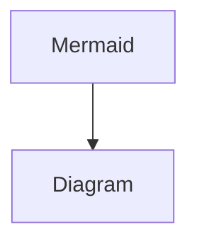

# Page 43

<details>

<summary>This is a question</summary>

blah blah blah blah

</details>

* item 1
* item 2
* item 3

```javascript
var sentences = [
  '$GPRMC,,V,,,,,,,,,,N*53',
  '$GPGGA,,,,,,0,00,99.99,,,,,,*48',
  '$GPGGA,182213.00,4531.14046,N,07334.85370,W,1,10,0.86,54.7,M,-32.6,M,,*58',
  '$GPRMC,182213.00,A,4531.14046,N,07334.85370,W,7.391,37.26,180516,,,A*4E'
];

```

#### Heading 3

some text

<figure><figcaption></figcaption></figure>

<figure><figcaption></figcaption></figure>



$$
f(x) = x * e^{2 pi i \xi x}
$$



***

> Someone said this

<table data-view="cards"><thead><tr><th></th><th data-hidden data-card-cover data-type="image">Cover image</th></tr></thead><tbody><tr><td>blah blah blah</td><td><a href=".gitbook/assets/IMG_7747.jpeg">IMG_7747.jpeg</a></td></tr><tr><td>blah blah blah 2</td><td><a href=".gitbook/assets/IMG_7089.jpeg">IMG_7089.jpeg</a></td></tr></tbody></table>
